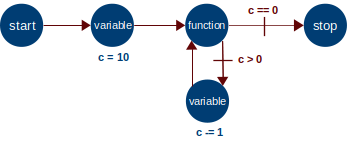
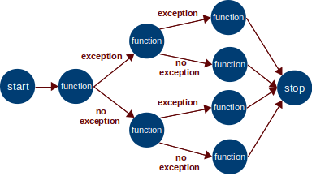
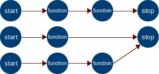

# Yapyseq user documentation

## Sequences in details

### Node types

In a sequence file, several kinds of nodes are available:

#### Start node

A start node is a node which is run when the sequence starts, without any 
condition. It does not have some special effects, its transitions are
immediately applied (if conditions are True). There can be several start nodes
in a single sequence, in that case all the start nodes are run at the same time
when the sequence starts. Another node cannot lead to a start node.

Here is its template:

```yaml
    id: <int>  # an integer being the unique ID of this node
    type: start
    transitions:  # a list of possible transitions
      - target: <int>  # the ID of the next node to run for this transition
        condition: <expr>  # (optional) the condition to fulfill to reach the target
```

Example:

```yaml
    id: 1
    type: start
    transitions:
      - target: 2
```

#### Stop node

A stop node is used to end a sequence branch. Any other node can lead to a
stop node. When a stop node is run, nothing happens and there cannot be any
further transition. There can be several stop nodes in a single sequence.
Reaching a stop node does not necessarily means that the whole sequence is
stopped, one branch can reach a stop node while another is still running
with some other nodes. A sequence stops when all the branches have reached
a stop node.

Here is its template:

```yaml
    id: <int>  # an integer being the unique ID of this node
    type: stop
```

Example:

```yaml
    id: 4
    type: stop
```

#### Function node

This is a the most useful node as it is the one which calls Python functions.

Here is its template:

```yaml
    id: <int>  # an integer being the unique ID of this node
    type: function
    function: <str>  # a string being the name of the Python function to run
    arguments:  # each argument of the function is listed 
      <arg_name>: <expr>  # its value will be evaluated as a Python expr.
    transitions:  # a list of possible transitions
      - target: <int>  # the ID of the next node to run for this transition
        condition: <expr>  # (optional) the condition to fulfill to reach the target
```

After the node is run, the result of the function is stored in the following
sequence variable: `results[<id>]` where `<id>` is the unique ID of the node.

A special data structure is used to store the result of a node function.
It contains the exception if it raised one, and the return object.
Here is its description:

```
result
    result.returned
    result.exception
        result.exception.is_raised
        result.exception.name
        result.exception.args
```

Example:

```yaml
    id: 1
    type: function
    function: list_path
    arguments:
      path: str('/tmp/')
    transitions:
      - target: 2
        condition: not results[1].exception.is_raised
      - target: 3
        condition: results[1].exception.is_raised
      - target: 4
        condtion: len(results[1].returned) > 0
      - target: 5
        condtion: len(results[1].returned) == 0
```

#### Variable node

A variable node is used to create/update some sequence variables. Sequence
variables are variables that can be referred in the sequence file itself. For
instance, they can be used in conditional expressions or in values of function
arguments.

Here is its template:

```yaml
    id: <int>  # an integer being the unique ID of this node
    type: variable
    variables:  # created/updated variables are listed here 
      <var_name>: <expr>  # its value will be evaluated as a Python expr.
    transitions:  # a list of possible transitions
      - target: <int>  # the ID of the next node to run for this transition
        condition: <expr>  # (optional) the condition to fulfill to reach the target
```

Example:

```yaml
    id: 1
    type: variable
    variables:  
      spam: spam + 1
    transitions:
      - target: 2
        condition: spam > 3
      - target: 3
        condition: spam <= 3
```

#### Parallel split node

A "parallel split" node is used to divide a sequence branch into several
branches that will be run in parallel. It is the only node which can have 
several successful transitions at the same time (without condition or with
a True condition). All the successful transitions are applied, therefore
leading to several nodes that will be run in parallel.

```yaml
    id: <int>  # an integer being the unique ID of this node
    type: parallel_split
    transitions:  # a list of possible transitions
      - target: <int>  # the ID of the next node to run for this transition
        condition: <expr>  # (optional) the condition to fulfill to reach the target
```

Example:

```yaml
    id: 1
    type: parallel_split
    transitions:  # a list of possible transitions
      - target: 2
      - target: 3
        condition: spam > 3
```

In this example, if `spam <= 3`, node 2 only will be run next. But if 
`spam > 3` then nodes 2 and 3 will be run in parallel.

#### Parallel sync node

A "parallel sync" node is used to merge several sequence branches into a single
branch. More than merging, it "synchronizes" them because it waits until all the 
merged branched are finished to continue. Merged branches are not directly
identified in the description of this node. A "parallel sync" node simply waits 
for **all** the incoming transitions to be applied (from other nodes to itself)
before applying its own transitions.

```yaml
    id: <int>  # an integer being the unique ID of this node
    type: parallel_sync
    transitions:  # a list of possible transitions
      - target: <int>  # the ID of the next node to run for this transition
        condition: <expr>  # (optional) the condition to fulfill to reach the target
```

Example:

```yaml
    id: 1
    type: parallel_sync
    transitions:  # a list of possible transitions
      - target: 2
```

In this example, when all the transitions (from other nodes) leading to node 1
(the "parallel sync" node) are done, then the transition to node 2 can be 
applied.

## Sequence variables of a sequence

A sequence can hold a certain quantity of variables possessed by the 
`SequenceRunner`. These variables can only be referenced in the sequence file.
Node functions cannot use them directly, but some sequence variables can be 
given to them through arguments. Only copies of variables are given to functions
not references themselves to prevent conflicting accesses to a same variables.

Sequence variables are fully managed by the `SequenceRunner`: creation,
transfer, deletion, update. This avoids conflicting accesses to sequences
variables, because there is only one Process which modifies them: the Process
of the `SequenceRunner`.

There are different kinds of sequence variables:
  * Built-in variables, created and managed by yapyseq. For instance, the return
    value of nodes. They are read-only for users.
  * User constants, defined in the sequence file or given by user when he
    runs the sequence. For instance, a comment about the run. They are read-only
    for users.
  * On-the-fly variables, created during the run of the sequence, for instance
    to manage loop counts. These variables are managed in nodes of type
    `variable`. These nodes do not allow to modify built-in variables or user 
    constants.
    
All of these variables can be used in *conditions of transitions*, in *function
arguments*, or in *variable nodes*.

### List of built-in variables:

  * returns: Return values of every nodes (last run only)
      A dedicated data structure is used to store the result of a node function.
      It contains the exception if it raised one, and the return object.
      To know the exact structure, please refer to 
      [Function node section](#Function-node)

### How to declare user constants?

**In a sequence file:**

```yaml
sequence:
  constants:
    my_constant: 10
    other_constant: "spam"
```

**During the call in console:**

```bash
yapyseq run Project/my_sequence.yaml Project/Functions -c my_constant int 10 -c other_constant str spam
```

Note that the type of the constant is given in the command line.

**During the call using the API:**

```python
from yapyseq import SequenceRunner

sr = SequenceRunner('Project/my_sequence.yaml', 
                    'Project/Functions',
                    constants={'my_constant': 10, 'other_constant': 'spam'})
sr.run()
```

## Transitions

Every node must have at least one transition, except stop nodes. A transition
has two attributes:
* the target: it is the ID of the next node to go to when the execution of the 
  current node is over.
* the condition: it is a Python expression that must return `True` in order to 
  validate the transition. Condition is optional, if there is none it is 
  by default equal to a `True`.

There must be one and only one validated transition per node, as a node 
cannot lead to several other nodes at the same time. Therefore, one must 
be careful while writing the conditions of the transitions.
This rule does not apply to a `parallel_split` node as it is a node which can
lead to several nodes.

## Examples of sequence structures

### Simple line


TODO

### Simple parallelism


TODO

### Simple loop



TODO

### Multiple paths



TODO

### Multiple start stop



TODO
